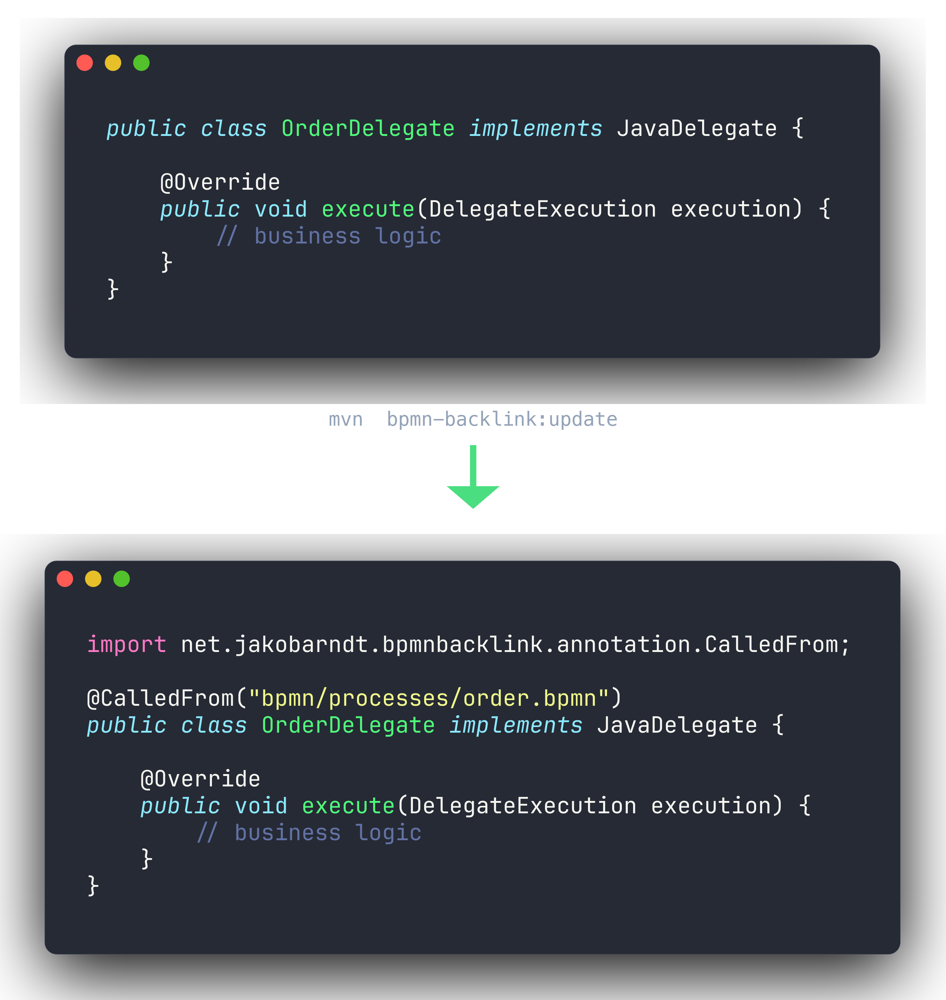
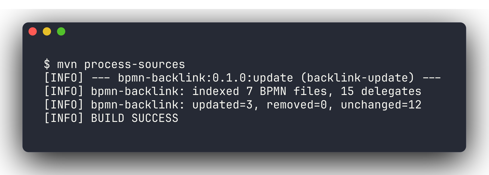
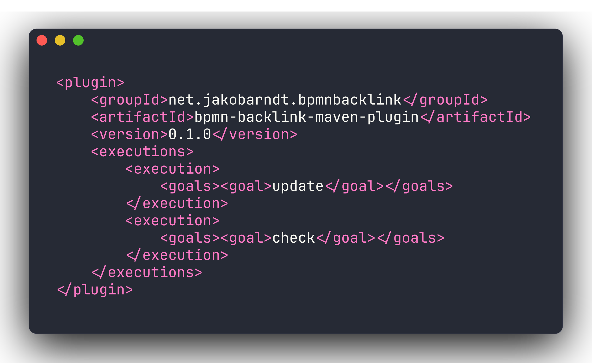

<div align="center">

# bpmn-backlink

#### Navigable backlinks from Camunda&nbsp;7 delegate code to the BPMN processes that call it — written into your sources and maintained at build time.

[](https://central.sonatype.com/artifact/net.jakobarndt.bpmnbacklink/bpmn-backlink-maven-plugin)
[](https://github.com/jjarndt/bpmn-backlink/actions/workflows/ci.yml)
[](LICENSE)
[](#requirements)

</div>

<p align="center"></p>

<p align="center"></p>

## Quickstart

Add the annotation dependency to the module with your delegates, so the generated import compiles:

```xml
<dependency>
    <groupId>net.jakobarndt.bpmnbacklink</groupId>
    <artifactId>bpmn-backlink-annotation</artifactId>
    <version>0.1.0</version>
</dependency>
```

Then add the plugin to the same module:

<p align="center"></p>

```xml
<plugin>
    <groupId>net.jakobarndt.bpmnbacklink</groupId>
    <artifactId>bpmn-backlink-maven-plugin</artifactId>
    <version>0.1.0</version>
    <executions>
        <!-- Keep the @CalledFrom annotations in sync during the build. -->
        <execution>
            <id>backlink-update</id>
            <phase>process-sources</phase>
            <goals>
                <goal>update</goal>
            </goals>
        </execution>
        <!-- Fail the build if the committed annotations are out of date. -->
        <execution>
            <id>backlink-check</id>
            <phase>verify</phase>
            <goals>
                <goal>check</goal>
            </goals>
        </execution>
    </executions>
</plugin>
```

## What it produces

Given a service task `<serviceTask camunda:class="com.example.OrderDelegate"/>` in
`src/main/resources/bpmn/processes/order.bpmn`, the `update` goal rewrites the delegate:

```java
import net.jakobarndt.bpmnbacklink.annotation.CalledFrom;

@CalledFrom("bpmn/processes/order.bpmn")
public class OrderDelegate implements JavaDelegate {
    ...
}
```

A delegate referenced from several processes gets a sorted, multi-valued annotation
(`@CalledFrom({ "a.bpmn", "b.bpmn" })`). Source formatting and comments outside the
annotation are preserved.

## Configuration

All parameters have sensible defaults and can be overridden:

| Parameter           | Default                                              | Goals          |
|---------------------|------------------------------------------------------|----------------|
| `sourceDirectory`   | `${project.build.sourceDirectory}`                   | update, check  |
| `bpmnDirectory`     | `${project.basedir}/src/main/resources/bpmn/processes` | update, check |
| `bpmnReferenceRoot` | `${project.basedir}/src/main/resources`              | update, check  |
| `skip`              | `false`                                              | update, check  |
| `failOnDrift`       | `true`                                               | check          |

BPMN paths are stored relative to `bpmnReferenceRoot` using `/` separators, so they line up
with classpath-relative deployment paths and stay navigable from the IDE.

## Goals

- `bpmn-backlink:update` — writes/refreshes the `@CalledFrom` annotations. Bound to the
  `process-sources` phase by default.
- `bpmn-backlink:check` — verifies the annotations are up to date without writing. Bound to
  the `verify` phase by default; fails the build on drift (configurable via `failOnDrift`).

## Scope

Version 0.1.0 targets Camunda 7 and the element-to-code relation only:

- Detected delegates: concrete classes implementing `JavaDelegate` or extending
  `AbstractJavaDelegate`.
- Detected references: `camunda:delegateExpression` (`${bean}` or `#{bean}`) and
  `camunda:class` on any BPMN element that carries them (service tasks, execution/task
  listeners, send tasks, business-rule tasks, message event definitions, ...). `camunda:expression`
  is not a delegate and is ignored.
- Out of scope for now: external-task topics, call activities (process-to-process), and
  Camunda 8 (`@JobWorker`).

## Requirements

- Java 17+
- Maven 3.9+
- Camunda 7 (the consuming project provides `camunda-engine`)

## Modules

- `bpmn-backlink-annotation` — the `@CalledFrom` annotation.
- `bpmn-backlink-core` — the engine: BPMN indexing (BPMN Model API), delegate scanning and
  annotation writing (JavaParser). No Maven dependency.
- `bpmn-backlink-maven-plugin` — the Maven plugin exposing the `update` and `check` goals.

## Building

```bash
mvn verify
```

This runs the unit tests, a maven-invoker integration test (`update` then `check` against a
sample project), and the JaCoCo coverage gate (100% line and branch per module). CI runs the
same on every push and pull request to `main`.

## License

Licensed under the Apache License, Version 2.0. See [LICENSE](LICENSE) and [NOTICE](NOTICE).
